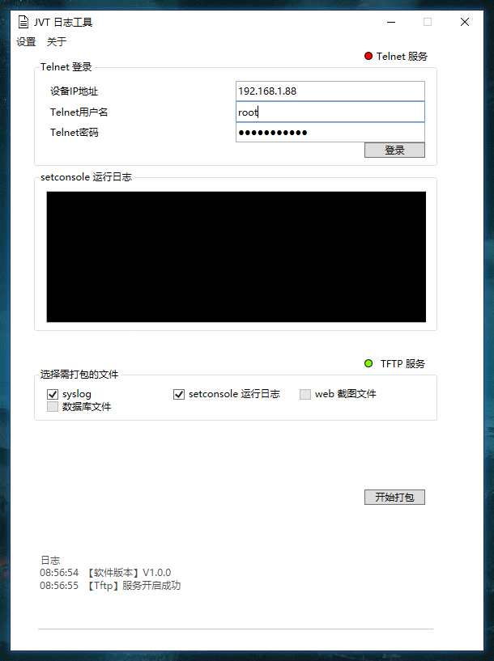
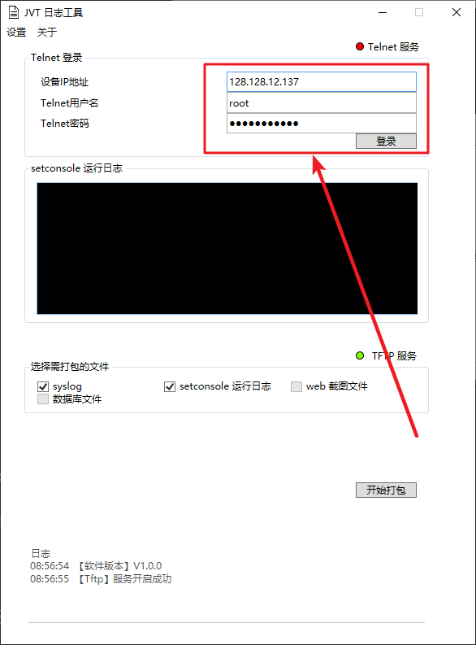
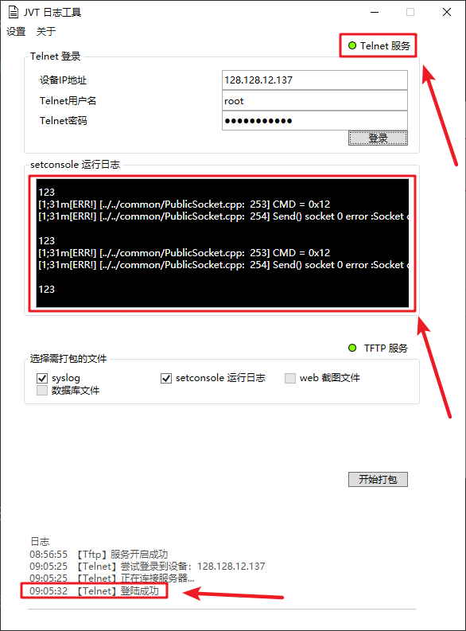
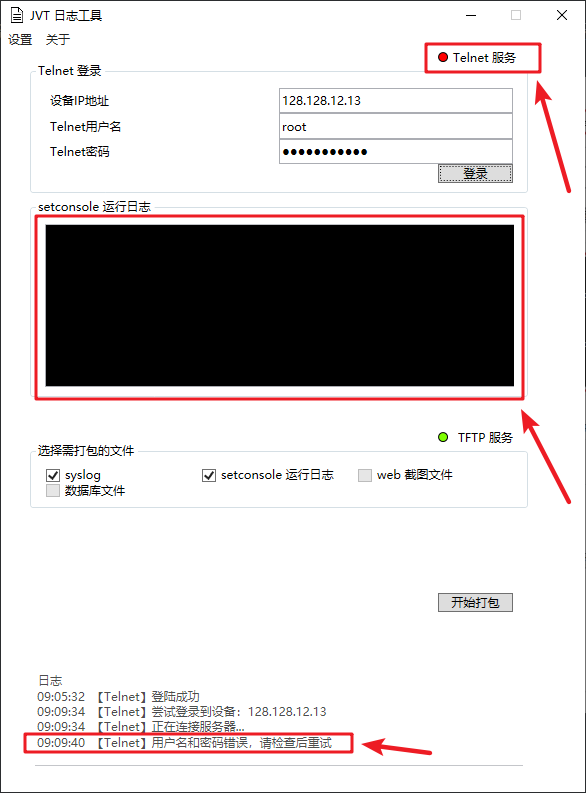
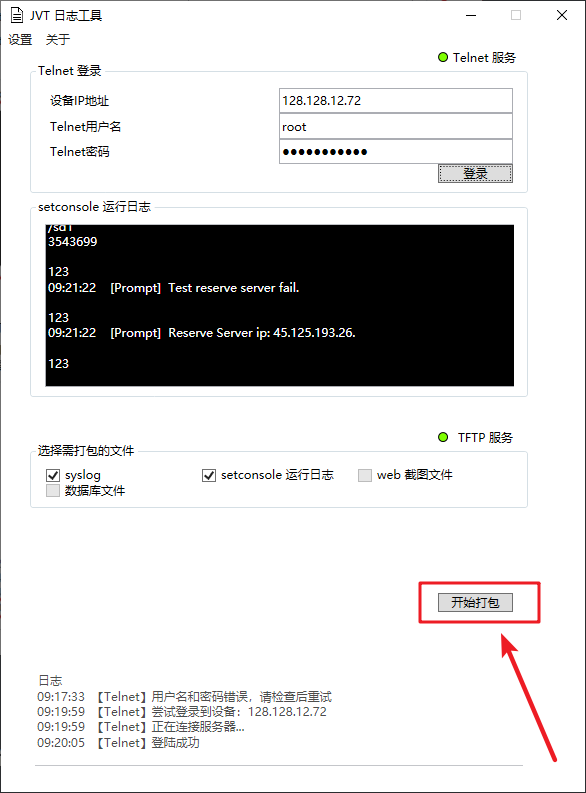
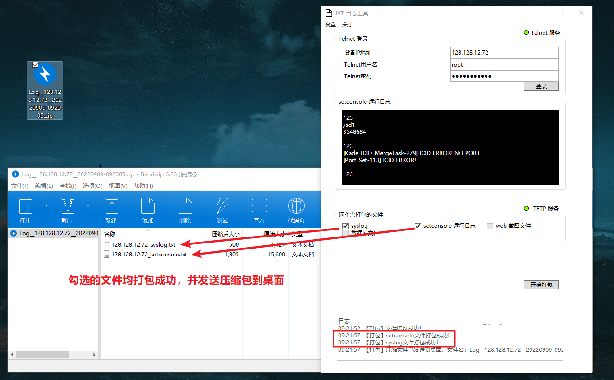
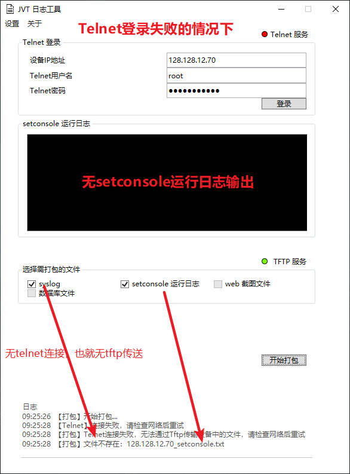

# JVT 日志工具（JvtLogTool）使用说明

嵌入式设备日志提取工具, 程序主界面如下，软件版本V1.0.0

## 使用方法

应用程序可以Telnet远程登录到设备，并获得设备实时的运行日志。此外通过TFTP服务器，可以从设备中取得一些文件，并打包成一个压缩包，发送到桌面。

### 1 获取设备 Setconsole 运行日志

通过Telnet登录到设备，然后程序会自动输入 `setconsole -r; setconsole;` 指令，输出设备的运行日志，并实时显示在程序UI中

### 1.1 输入设备IP、Telnet用户名和密码

### 1.2 点击登录按钮

### 1.2.1 登录成功效果

右上角『Telnet服务』显示绿色；中间的黑框，开始持续输出设备运行日志；左下角日志显示“【Telnet】登陆成功”。

### 1.2.2 登录失败效果

右上角『Telnet服务』显示红色；中间的黑框为空，无输出；右下角日志显示错误信息，当前错误信息是”用户名和密码错误“

### 2 打包文件

### 2.1 在Telnet登录成功的情况下，点击开始打包按钮

注意勾选需要打包的文件，其中syslog文件将从设备中取得，setconsole日志文件从本地日志缓存中获得。

### 2.1.2 打包成功示例

填写正确的设备IP和Telnet用户名和密码

### 2.1.2 打包失败示例

输入不在线的一台设备IP地址，此时将无法获得`setconsole运行日志`亦或是`syslog文件`

